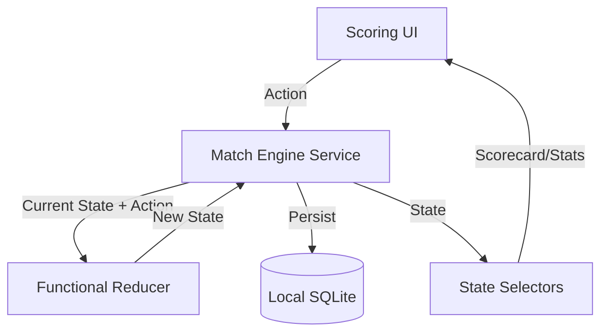

# Phase 1: Match Engine (Core Rules) - Research

**Researched:** 2026-04-18
**Domain:** Cricket Scoring Logic / Functional State Management
**Confidence:** HIGH

<user_constraints>
## User Constraints (from CONTEXT.md)

### Locked Decisions
- **D-01: Pure Functional Reducer Pattern.** The engine will follow the pattern `(state, event) => newState`. This ensures portability between the mobile capture app and the web reporting portal.
- **D-02: Event Stream Source of Truth.** The canonical state is a list of events. Summaries like scorecards and batter stats are derived from this stream on demand.
- **D-03: Silent Failure Error Handling.** If an invalid event is attempted (e.g., scoring after a match is complete), the engine returns the original state unchanged rather than throwing an error.
- **D-04: Dynamic Rule Injection.** The engine does not include hardcoded presets for "Corporate" or "T20" formats. Rules (max overs, players per team) must be explicitly provided when initializing a match state.

### the agent's Discretion
- Implementation of the reducer internal logic.
- Structure of the derived state selectors.
- Organization of the shared package.

### Deferred Ideas (OUT OF SCOPE)
- **MCC 2022 Compliance**: "Crossing" rules and penalty runs are deferred to Phase 2.
- **Persistence**: SQLite storage and file exports are deferred to Phase 3.
- **FORMAT-02**: "Last Man Stand" (LMS) logic is deferred to Phase 2.
</user_constraints>

<phase_requirements>
## Phase Requirements

| ID | Description | Research Support |
|----|-------------|------------------|
| FORMAT-01 | User can configure match with 5 players per team and 5 overs per innings. | Engine supports dynamic `MatchRules` injection. |
| FORMAT-03 | User can handle standard extras (Wides/No-balls) as 1 run plus an extra ball. | Reducer logic for `ExtraBallEvent` handles run addition and legal ball counting. |
| RULE-01 | User can capture ball-by-ball events (runs, extras, wickets). | Event-driven architecture with `BallEvent` stream. |
| RULE-02 | User can manage automatic over completion and bowler rotation logic. | Reducer handles strike rotation on over end and non-consecutive bowler enforcement. |
</phase_requirements>

## Summary

This phase focuses on building a deterministic, pure functional scoring engine for cricket. Following the decisions in `01-CONTEXT.md`, the engine will implement a reducer pattern `(state, action) => state` where the match state is transformed by discrete ball events. This ensures that scoring logic is identical across the React Native mobile app (capture) and the Next.js web app (reporting/replay).

The engine will support dynamic match configurations (overs, players, extras) and handle core cricket transitions: strike rotation, over completions, and innings endings.

**Primary recommendation:** Implement the engine as a standalone package `packages/match-engine` using a Redux-style reducer and a set of "Selectors" for derived state (scorecards, player stats).

## Architectural Responsibility Map

| Capability | Primary Tier | Secondary Tier | Rationale |
|------------|-------------|----------------|-----------|
| Scoring Logic (Reducer) | Shared Package | — | Must be identical on Mobile and Web. |
| Match State Management | Client (Mobile) | — | Mobile app manages the live scoring session. |
| Scorecard Generation | Shared Package | — | Derived from event stream; consumed by both apps. |
| Persistence | Client (Mobile) | — | Offline-first requirement for scoring. |
| Rule Enforcement | Shared Package | — | Centralized logic for MCC/Corporate rules. |

## Standard Stack

### Core
| Library | Version | Purpose | Why Standard |
|---------|---------|---------|--------------|
| TypeScript | 5.7.3 | Type safety | Monorepo standard; critical for complex domain logic. |
| @inningspro/shared-types | workspace:* | Domain models | Canonical types for Match, Innings, and Events. |
| Zod | 3.24.2 | Input validation | Used for validating actions and match configurations. |

### Supporting
| Library | Version | Purpose | When to Use |
|---------|---------|---------|--------------|
| node:test | Built-in | Unit testing | Project standard for packages; fast and zero-dep. |
| node:assert | Built-in | Assertions | Used within tests. |

### Alternatives Considered
| Instead of | Could Use | Tradeoff |
|------------|-----------|----------|
| Hand-rolled logic | `cricket-utils` | No high-quality, maintained logic libraries found; custom implementation allows for "Corporate" rule flexibility. |
| Reducer Pattern | OO Match Class | Harder to share state between apps and implement "Undo" via event replay. |

**Installation:**
```bash
# Inside packages/match-engine
pnpm init
pnpm add zod
pnpm add -D typescript @types/node
```

## Architecture Patterns

### System Architecture Diagram



### Recommended Project Structure
```
packages/match-engine/
├── src/
│   ├── reducer/         # Core (state, action) => state logic
│   ├── selectors/       # Derived state (scorecards, stats)
│   ├── rules/           # Rule-specific logic (rotation, extras)
│   ├── types/           # Internal engine types and Actions
│   └── index.ts         # Public API
└── tests/               # Ball-by-ball scenario tests
```

### Pattern 1: Pure Functional Reducer
**What:** The engine never "mutates" a match. It takes the current `Match` and an `Action` (e.g., `RecordBall`) and returns a new `Match` object.
**When to use:** All scoring events.
**Example:**
```typescript
// Proposed Engine Signature
export function matchReducer(state: Match, action: ScoringAction): Match {
  switch (action.type) {
    case 'RECORD_BALL':
      return recordBall(state, action.payload);
    case 'START_MATCH':
      return { ...state, status: 'live' };
    default:
      return state;
  }
}
```

### Anti-Patterns to Avoid
- **Database calls inside the reducer:** The reducer MUST be pure. Persistence is handled by the caller (service layer).
- **Hardcoded T20/ODI rules:** Rules must be injected via `MatchRules` to support 5-over corporate formats.

## Don't Hand-Roll

| Problem | Don't Build | Use Instead | Why |
|---------|-------------|-------------|-----|
| Schema Validation | Custom if/else | Zod | Robust validation and error reporting. |
| Date Handling | Date object math | ISO Strings | Use `ISODateTime` strings from `shared-types` for serialization compatibility. |

## Environment Availability

| Dependency | Required By | Available | Version | Fallback |
|------------|------------|-----------|---------|----------|
| Node.js | Runtime/Tests | ✓ | 18.x+ | — |
| pnpm | Package Management| ✓ | 9.15.4 | — |
| shared-types | Core Logic | ✓ | workspace:*| — |

## Common Pitfalls

### Pitfall 1: Non-consecutive Bowler Rule
**What goes wrong:** A bowler is allowed to bowl two overs in a row.
**How to avoid:** The reducer must check the `bowlerId` of the previous over's last ball and reject/warn if the same ID is used for the new over.

### Pitfall 2: Over Completion with Extras
**What goes wrong:** Wides/No-balls increment the ball count in the over.
**How to avoid:** Logic must explicitly distinguish between "Total Balls" and "Legal Balls". Wides and No-balls are not legal balls.

### Pitfall 3: Float Precision in Run Rate
**What goes wrong:** `5 / 0.2` (for 2 balls) results in incorrect calculations or division by zero.
**How to avoid:** Use a standard selector that handles "0 legal balls" and rounds to 2 decimal places.

## Code Examples

### State Selector Pattern
```typescript
// packages/match-engine/src/selectors/scorecard.ts
export const getScorecard = (match: Match) => {
  const currentInnings = match.innings[match.innings.length - 1];
  return currentInnings.events.reduce((summary, event) => {
    // Calculate runs, wickets, extras per batter and bowler
    return summary;
  }, initialSummary);
};
```

## Validation Architecture

### Test Framework
| Property | Value |
|----------|-------|
| Framework | node:test |
| Config file | package.json |
| Quick run command | `node --test tests/**/*.test.ts` |

### Phase Requirements → Test Map
| Req ID | Behavior | Test Type | Automated Command |
|--------|----------|-----------|-------------------|
| FORMAT-01 | 5 overs / 5 players config | Unit | `node --test tests/config.test.ts` |
| FORMAT-03 | Extras (1 run + extra ball) | Unit | `node --test tests/extras.test.ts` |
| RULE-01 | Ball-by-ball capture | Integration| `node --test tests/engine.test.ts` |
| RULE-02 | Over/Bowler rotation | Unit | `node --test tests/rotation.test.ts` |

## Security Domain

### Applicable ASVS Categories
| ASVS Category | Applies | Standard Control |
|---------------|---------|-----------------|
| V5 Input Validation | yes | Zod validation for all Scoring Actions. |

## Sources

### Primary (HIGH confidence)
- `01-CONTEXT.md` - Functional reducer and event stream decisions.
- `shared-types/src/index.ts` - Domain model verification.
- MCC Law 17.6 - Bowler rotation rules.

### Secondary (MEDIUM confidence)
- Web search for 5-a-side 5-over corporate rules.

## Metadata

**Confidence breakdown:**
- Standard stack: HIGH - Follows monorepo patterns.
- Architecture: HIGH - Reducer pattern is industry standard for this domain.
- Pitfalls: HIGH - Based on common cricket scoring edge cases.

**Research date:** 2026-04-18
**Valid until:** 2026-05-18
