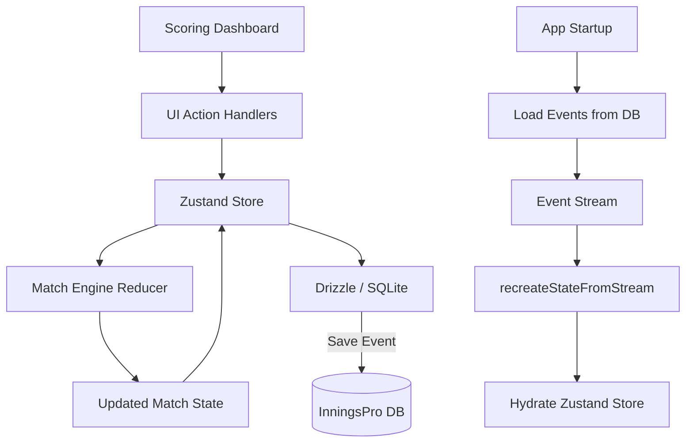

# Phase 03: Mobile Scoring App & Persistence - Research

**Researched:** 2026-04-19
**Domain:** Mobile App (Expo), Local Persistence (SQLite/Drizzle), State Management (Zustand), Export (.ipro)
**Confidence:** HIGH

## Summary

Phase 03 focuses on delivering the "Capture" tier of the InningsPro system. The mobile app serves as an offline-first, reliable tool for cricket scorers. Research confirms that the foundation in `apps/mobile` is already using the recommended stack (Expo, Drizzle, Zustand, NativeWind). The primary architectural shift required is integrating the `@inningspro/match-engine` package (completed in Phases 1-2) to replace local placeholder scoring logic. This ensures that the mobile app strictly enforces MCC laws and supports the portable `.ipro` schema format for downstream web reporting.

**Primary recommendation:** Use an event-sourced persistence model where only discrete ball events are stored in SQLite, and the full match state is reconstructed using the `@inningspro/match-engine`'s `recreateStateFromStream` function during app initialization or undo operations.

## Architectural Responsibility Map

| Capability | Primary Tier | Secondary Tier | Rationale |
|------------|-------------|----------------|-----------|
| Scoring Logic | Match Engine (Shared) | Mobile App (State) | Rules must be consistent across mobile and web. |
| Ball Capture UI | Mobile App (UI) | — | Real-time, low-latency interaction required. |
| Offline Persistence | SQLite (Local) | Drizzle ORM | Essential for match reliability in areas with poor connectivity. |
| Match Export | Expo File System | Sharing API | Portable `.ipro` files are the handoff mechanism to the web portal. |
| Haptic Feedback | Expo Haptics | — | Enhances scorer confidence during fast-paced play. |

## Standard Stack

### Core
| Library | Version | Purpose | Why Standard |
|---------|---------|---------|--------------|
| Expo | ~52.0.28 | App Framework | Industry standard for cross-platform React Native. |
| Drizzle ORM | ^0.38.4 | Type-safe ORM | Provides SQL-like experience with full TypeScript safety for SQLite. |
| Expo-SQLite | ~15.1.4 | Local DB | Native SQLite driver for Expo (next-gen API). |
| Zustand | ^5.0.3 | State Management | Lightweight, performant, and scales well for scoring state. |
| NativeWind | ^4.1.23 | Styling | Tailwinds CSS for React Native (v4 for better performance). |

### Supporting
| Library | Version | Purpose | When to Use |
|---------|---------|---------|--------------|
| @inningspro/match-engine | workspace:* | Scoring Rules | All state transitions and score calculations. |
| Expo-File-System | ^55.0.10 | File IO | Saving `.ipro` files to local storage before sharing. |
| Expo-Sharing | ^55.0.11 | File Sharing | Exporting matches to email, WhatsApp, or cloud storage. |
| Expo-Haptics | ~14.0.1 | UX | Tactile feedback for confirmed actions. |

**Installation:**
```bash
# Existing in apps/mobile, but verify match-engine link
pnpm add @inningspro/match-engine @inningspro/shared-types @inningspro/export-schema
```

## Architecture Patterns

### System Architecture Diagram



### Recommended Project Structure
```
apps/mobile/src/
├── core/
│   └── database/      # Drizzle schema and migrations
├── features/
│   ├── match/         # Match setup and selection
│   └── scoring/       # Real-time capture UI and store
├── services/
│   ├── engine.ts      # Wrapper for @inningspro/match-engine
│   ├── export.ts      # .ipro generation logic
│   └── share.ts       # Sharing API integration
└── components/        # Shared UI components (Atomic)
```

### Pattern 1: Event-Sourced Hydration
Instead of storing a snapshot of the score (which can drift), the app stores the raw event log.
**Example:**
```typescript
// apps/mobile/src/features/scoring/store/useScoringStore.ts
import { recreateStateFromStream, matchReducer } from '@inningspro/match-engine';

const useScoringStore = create((set) => ({
  loadMatch: async (matchId) => {
    const events = await db.query.ballEvents.findMany({ where: eq(ballEvents.matchId, matchId) });
    const match = await db.query.matches.findFirst({ where: eq(matches.id, matchId) });
    
    const initialState = recreateStateFromStream(matchId, match.rules, events);
    set({ matchState: initialState });
  }
}));
```

## Don't Hand-Roll

| Problem | Don't Build | Use Instead | Why |
|---------|-------------|-------------|-----|
| Scoring Rules | Custom `if/else` logic | `@inningspro/match-engine` | Cricket laws (Crossing, LMS, Penalty) are complex and already implemented/tested. |
| ID Generation | Integer increments | `crypto.randomUUID()` or `nanoid` | Avoid collisions during offline sync/export. |
| Form Validation | Manual regex | `zod` | Already used in shared packages for schema validation. |
| Style Constants | Custom object themes | `NativeWind` | Maintain consistency with web tailwind styles. |

## Runtime State Inventory

| Category | Items Found | Action Required |
|----------|-------------|------------------|
| Stored data | SQLite `ball_events` table | **Data migration**: Current schema lacks `kind` and specific fields like `runsOffBat` and `isBoundary`. Existing records should be cleared or migrated to new `shared-types` format. |
| Live service config | None | — |
| OS-registered state | None | — |
| Secrets/env vars | None | — |
| Build artifacts | None | — |

## Common Pitfalls

### Pitfall 1: Drizzle Migration Sync
**What goes wrong:** Schema changes in `schema.ts` aren't reflected in the local `inningspro.db` on the device.
**How to avoid:** Use `drizzle-kit generate` to produce migration files and ensure `initializeDatabaseMigrations()` is called at app root before any DB access.

### Pitfall 2: Double-Tap Scoring
**What goes wrong:** Rapidly tapping a run button adds multiple balls before the first one is persisted.
**How to avoid:** Implement a simple `isLoading` or `isProcessing` flag in the Zustand store to disable UI buttons during the async persistence cycle.

### Pitfall 3: Stale Striker State
**What goes wrong:** "Undo" reverts the ball but the UI doesn't correctly swap strikers back.
**How to avoid:** Rely entirely on `match-engine` for strike rotation; never manually manage `strikerId` in the store except through the engine.

## Code Examples

### Integrated Scoring Action
```typescript
// apps/mobile/src/services/engine.ts
import { matchReducer, type MatchEngineAction } from '@inningspro/match-engine';
import { databaseService } from './db.service';

export async function processScoringAction(state: MatchEngineState, action: MatchEngineAction) {
  // 1. Get next state from engine
  const nextState = matchReducer(state, action);
  
  // 2. Persist event if successful
  if (!nextState.lastRejectionReason) {
    await databaseService.addBallEvent(mapActionToDBEvent(action));
  }
  
  return nextState;
}
```

### .ipro Export Payload
```typescript
// apps/mobile/src/services/export.service.ts
import { type MatchExportSchemaV1 } from '@inningspro/shared-types';
import { parseMatchExport } from '@inningspro/export-schema/v1';

export async function generateExport(matchId: string): Promise<string> {
  const match = await fetchFullMatchData(matchId); // Joins players, teams, innings, events
  const payload: MatchExportSchemaV1 = {
    schemaVersion: '1.0.0',
    exportedAt: new Date().toISOString(),
    tournament: match.tournament,
    teams: [match.homeTeam, match.awayTeam],
    match: match
  };
  
  // Validate before writing
  return JSON.stringify(parseMatchExport(payload));
}
```

## Environment Availability

| Dependency | Required By | Available | Version | Fallback |
|------------|------------|-----------|---------|----------|
| Node.js | Development | ✓ | 25.8.2 | — |
| pnpm | Package Mgmt | ✗ | — | Use `npm` or fix path |
| Expo CLI | Build/Run | ✓ | 0.19.14 | — |
| SQLite | Persistence | ✓ | 3.x (Native) | — |

## Validation Architecture

### Test Framework
| Property | Value |
|----------|-------|
| Framework | Vitest / Jest (Expo) |
| Config file | `jest.config.js` |
| Quick run command | `npm test` |
| Full suite command | `npm test -- --coverage` |

### Phase Requirements → Test Map
| Req ID | Behavior | Test Type | Automated Command | File Exists? |
|--------|----------|-----------|-------------------|-------------|
| STORE-01 | Offline match persistence | integration | `npm test src/services/db.service.test.ts` | ❌ Wave 0 |
| STORE-02 | .ipro schema export | unit | `npm test src/services/export.service.test.ts` | ❌ Wave 0 |
| RULE-01+ | Match engine integration | unit | `npm test src/features/scoring/store/useScoringStore.test.ts` | ❌ Wave 0 |

## Security Domain

### Applicable ASVS Categories

| ASVS Category | Applies | Standard Control |
|---------------|---------|-----------------|
| V5 Input Validation | yes | Zod schema validation for exports/imports. |
| V6 Cryptography | no | Local DB is unencrypted for v1 (standard for local-only apps). |
| V12 File Upload | yes | Validate `.ipro` schema on import (future Phase 4). |

### Known Threat Patterns for Expo/SQLite

| Pattern | STRIDE | Standard Mitigation |
|---------|--------|---------------------|
| SQL Injection | Tampering | Drizzle ORM uses parameterized queries by default. |
| Data Corruption | Availability | Use SQLite Transactions for ball-entry + event-log updates. |
| Schema Leakage | Info Disclosure | Minimize sensitive data in local storage; obfuscate IDs. |

## Sources

### Primary (HIGH confidence)
- `packages/match-engine` - Source code for core scoring rules.
- `packages/shared-types` - Canonical data models for events and matches.
- `packages/export-schema` - Zod validators for the export format.
- `apps/mobile/package.json` - Current tech stack and dependencies.

### Secondary (MEDIUM confidence)
- Drizzle ORM Documentation (Expo SQLite adapter) - For migration and transaction patterns.
- Expo Router Documentation - For dynamic scoring routes.

## Metadata

**Confidence breakdown:**
- Standard stack: HIGH - Verified in `package.json` and existing code.
- Architecture: HIGH - Aligns with Phase 1-2 engine outputs.
- Pitfalls: MEDIUM - Based on common Expo/Drizzle patterns.

**Research date:** 2026-04-19
**Valid until:** 2026-05-19
