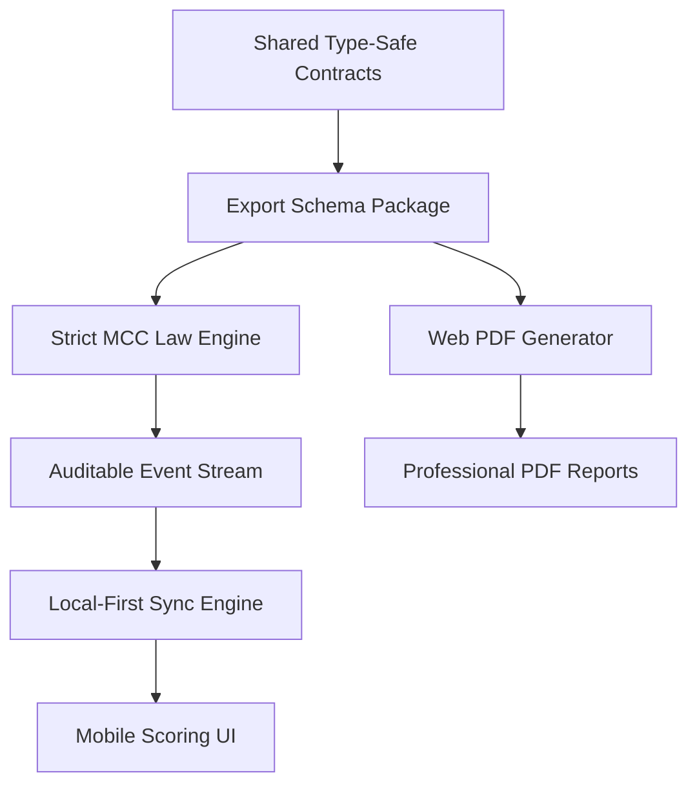

# Feature Landscape

**Domain:** Cricket Scoring & Reporting (InningsPro)
**Researched:** 2025-05-22
**Overall Confidence:** HIGH

## Table Stakes

Features users expect in any production-grade cricket scoring application. Missing these would make the product feel incomplete or unreliable.

| Feature | Why Expected | Complexity | Notes |
|---------|--------------|------------|-------|
| **Ball-by-Ball Entry** | Core function of any scoring app. | Low | Must capture runs, wickets, and all extra types. |
| **Strike Rotation** | Automatic handling of batter ends. | Low | Swap on odd runs and end of overs. |
| **Standard Dismissals** | 10 standard ways to get out. | Medium | Capture Bowled, Caught, LBW, Run Out, Stumped, etc. |
| **Over Management** | Automated counting of legal balls. | Low | Handle No Balls/Wides as non-legal balls (don't increment over count). |
| **Extra Types** | Wide, No Ball, Bye, Leg Bye. | Medium | Proper bowler debiting (Wides/No Balls) vs Team extras (Byes/Leg Byes). |
| **Basic Digital Scorecard** | Instant view of the current state. | Low | Batting table (Runs, Balls, 4s, 6s) and Bowling table. |
| **Local Persistence** | Reliability in the field. | Medium | App must recover state if closed or crashed during a match. |

## Differentiators

Features that set InningsPro apart by focusing on technical reliability (local-first) and official compliance (strict rules).

| Feature | Value Proposition | Complexity | Notes |
|---------|-------------------|------------|-------|
| **Local-First Event Sync** | 100% reliability in remote grounds with no internet. | High | Uses an append-only event stream with Last-Write-Wins (LWW) conflict resolution. |
| **Strict MCC Law Engine** | Moves from a "calculator" to an "umpire's assistant." | High | Automated Follow-on, Penalty Runs (Law 41/42), and complex dismissal logic. |
| **Auditable Event Stream** | Transparency and correction capability. | Medium | Every ball is an immutable event; allows for precise overrides and audit trails. |
| **Professional PDF Reports** | High-quality, portable match artifacts. | Medium | Generates "Box Style" summaries and "Linear" scorebooks from uploaded schemas. |
| **Visual Analytics (PDF)** | Insight beyond just numbers. | High | Manhattan charts, Run Rate graphs, and Partnership milestones in the PDF export. |
| **Schema-Based Portability** | Decouples capture from viewing. | Medium | Matches are exported as type-safe JSON files, ensuring future-proof data ownership. |

## Anti-Features

Features to explicitly NOT build for the baseline version to maintain focus on core value (reliable capture and reporting).

| Anti-Feature | Why Avoid | What to Do Instead |
|--------------|-----------|-------------------|
| **Live Public Broadcasting** | High infrastructure cost and latency complexity. | Focus on high-quality post-match artifacts (PDFs) and shared schema files. |
| **Advanced ML Analytics** | Premature optimization; distracts from scoring accuracy. | Provide raw data in the schema for external tools to analyze if needed. |
| **League Administration** | Expands scope to tournament brackets and payments. | Focus on the "Match" as the unit of value; keep it a tool for individual matches/teams. |
| **Real-time Video Overlay** | Extremely high technical barrier (encoding, bandwidth). | Provide a clean "Web Overlay" URL for third-party streaming tools to consume. |

## Feature Dependencies

## MVP Recommendation

Prioritize the "Reliability Loop":

1.  **Strict Law Engine**: Core scoring logic that prevents invalid states (e.g., bowling 7 balls in an over unless penalty/extra).
2.  **Local-First Sync**: Append-only event log in SQLite to ensure no ball is ever lost.
3.  **Basic PDF Export**: A professional "Box Style" summary to fulfill the "Reporting" promise of InningsPro.

**Defer**: Visual analytics (graphs) and complex penalty run workflows until the core sync and law engine are stable.

## Sources

- [MCC Laws of Cricket (2017 Code, 3rd Edition 2022)](https://www.lords.org/mcc/the-laws-of-cricket)
- [Local-First Web Development (Ink & Switch)](https://www.inkandswitch.com/local-first/)
- [Professional Cricket Scorecard Standards (BCCI/ICC Patterns)](https://www.bcci.tv/stats)
- [Next.js PDF Generation Patterns (@react-pdf/renderer)](https://react-pdf.org/)
